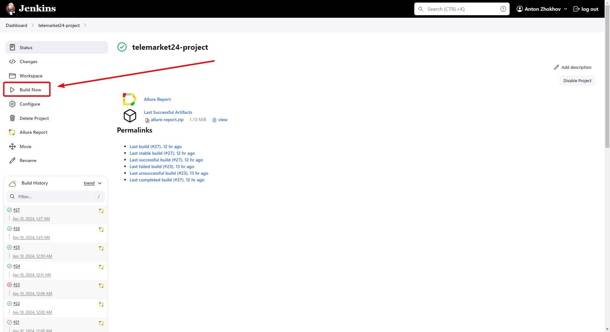
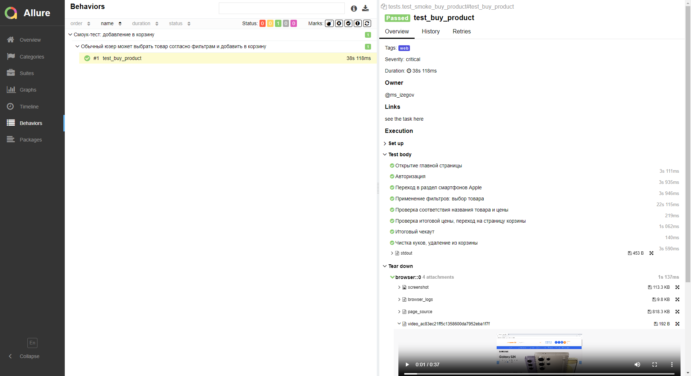
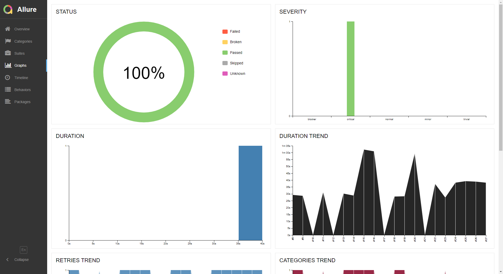
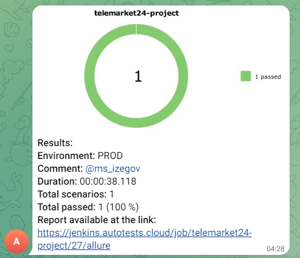

## Проект UI-автотестов для telemarket24 (WEB)
<!-- Технологии -->

## :gear: Используемые технологии
<p  align="center">
  <code></code>
  <code></code>
  <code></code>
  <code></code>
  <code></code>
  <code></code>
  <code></code>
  <code></code>
  <code></code>
  <code></code>
</p>

## 📹: Видео-прогон

<p align="center">
  
</p>

## :open_book: Описание
В проекте представлен один **высокоуровневый** смоук-тест всего бизнес-пути, написанный на Python + Selenium с применением модели PageObject.  
  
По факту этот высокоуровневый тест может быть разбит на **множество низкоуровневых**, ведь частью общего "смоука" являются отдельные смысловые блоки такие как:  
- [x] Авторизация пользователя
- [x] Работа с товаром: добавление в коризину, сохранение и проверка названия и цены в разных частях UI
- [x] Работа фильтров
- [x] Отдельные тесты каждой из страниц/модулей (модуль авторизации, главная страница, страница с выбором товара, страница корзины, модуль корзины в хэдэре)
  
UI-тест на сайте `telemarket24.ru`  
  
Точка `A`: главная страница сайта 
  
Точка `B`: страница корзины, сверка товара, очистка корзины и куков как постусловие
  
Подключена система отчетности Allure Reports с вложениями (логи, скриншоты, видео и пр.)   
  
Шаги отображены в виде степов через `with allure.step`  
  
Также по факту прохождения теста отправляется уведомление с результатами в Telegram.  
  
Браузер в UI-тестах запускается удаленно в Selenoid.  

## :heavy_check_mark: Кратко
- [x] `UI` тесты
- [x] Запуск WEB тестов, используя `Jenkins` и `Selenoid`
- [x] `Allure Reports` с вложениями (логи, скриншоты, видео)
- [x] Отправка результатов тестирования в `Telegram`

<!-- Тест кейсы -->

## :heavy_check_mark: Что проверяют WEB тесты?
- [x] Работа на главной странице - переход к модулю авторизации, открытие вкладок
- [x] Авторизация
- [x] Переход в раздел смартфонов Apple
- [x] Применение фильтров: выбор товара
- [x] Проверка соответствия названия товара и цены
- [x] Проверка итоговой цены, переход на страницу корзины
- [x] Итоговый чекаут на странице корзины
- [x] Чистка корзины

<!-- Jenkins -->

##  Запуск тестов из Jenkins

Для запуска тестов из Jenkins:
Нажмите кнопку "Build"

<p></p>

<!-- Отчеты -->

## :bar_chart: Отчеты о прохождении тестов доступны в Allure

> При локальном запуске введите в командной строке: 
```bash
allure serve 
```

###  Allure

#### Примеры отображения тестов



#### Во вкладке Graphs можно посмотреть графики о прохождении тестов, по их приоритезации, по времени прохождения и др.



###  Telegram

Настроена отправка отчета в Telegram


